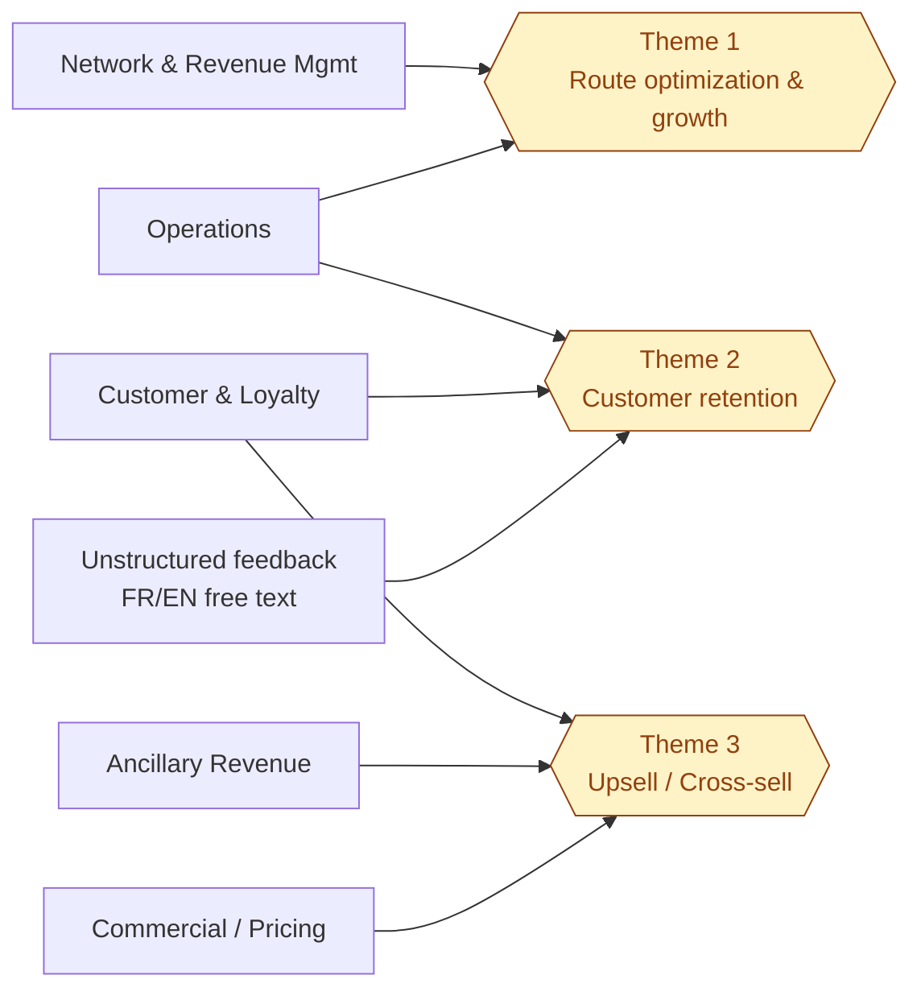
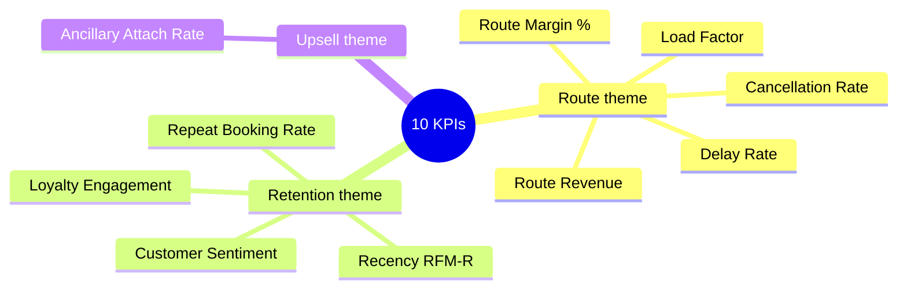

# Part 1 — Business framing & KPIs

> **Decision question** (per brief): *Where should Air Côte d'Ivoire invest first to maximize profitable growth: route expansion and optimization, customer retention, or upsell / cross-sell?*

## 1. Business domains in scope

The brief explicitly names five interdependent airline domains. The analytics product must serve them all because the decision question is cross-functional.

| Domain | Decision owner | Strategic question (next 12 months) |
|---|---|---|
| **Network & Revenue Management** | VP Network | Which routes to open / reinforce / close? |
| **Operations** | COO | Which routes lose margin to operational issues vs weak demand? |
| **Commercial / Pricing** | Revenue Manager | Fare class mix, dynamic pricing, channel strategy? |
| **Customer & Loyalty** | Chief Customer Officer | Who to retain, who to upgrade in tier, who to reactivate? |
| **Ancillary Revenue** | Ancillary Manager | Which ancillaries to push, to whom, when? |

**Mapping to the three challenge themes**

- **Route optimization & growth** ← Network + Operations
- **Customer retention** ← Customer/Loyalty + Operations signals (delays drive churn) + Unstructured sentiment
- **Upsell / Cross-sell** ← Ancillary + Customer + Commercial

## 2. KPIs to guide decisions

The brief lists nine example KPIs. We cover all of them plus *Recency* (the basis of the RFM retention signal), giving **10 KPIs** that map cleanly to the three themes.

| KPI | Formula | Theme | Grain |
|---|---|---|---|
| **Route Revenue** | `SUM(ticket_price + ancillary_revenue)` on Flown bookings | Route | Route × period |
| **Route Margin %** | `(Revenue − Direct Operating Cost) / Revenue` | Route | Route × period |
| **Load Factor** | `SUM(passengers) / SUM(seat_capacity)` | Route | Flight → Route |
| **Delay Rate (OTP-inverse)** | `flights with delay_min > 15 / operated flights` | Route | Route × period |
| **Cancellation Rate** | `cancelled / scheduled` | Route | Route × period |
| **Repeat Booking Rate** | customers with ≥2 bookings in 12m / active customers | Retention | Segment × period |
| **Recency (RFM-R)** | days since last booking — drives churn signal | Retention | Customer |
| **Loyalty Engagement** | total points earned per active member in 12m | Retention | Tier × period |
| **Ancillary Attach Rate** | bookings with ancillary > 0 / total bookings | Upsell | Segment × Route |
| **Customer Sentiment** | mean sentiment score derived from feedback text | Retention / Route | Customer / Route |

Each formula is the source of truth that the Part-2 semantic layer (`dbt/models/semantic/_metrics.yml`) materialises.

