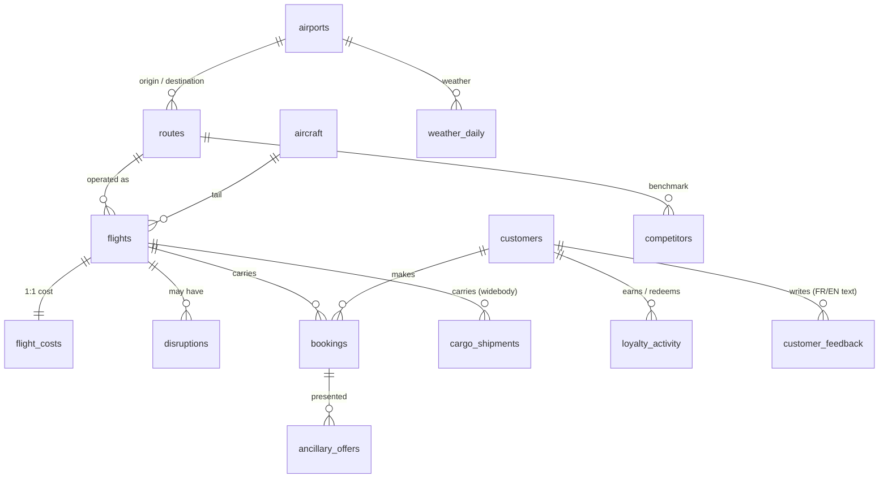

# Data dictionary — `data/enriched/` reference

Column-level reference for every parquet the Part-2 dbt project consumes. Reference doc, not a Part-1 deliverable (assumptions live in [03_assumptions.md](03_assumptions.md)).

**Layering**: `data/raw/` (immutable starter Excel) → `data/enriched/` (this doc) → dbt staging (rename + cast).

## Source overview (entities & foreign keys)

## Reference / dimensions

### `airports.parquet` (13 rows)
| Column | Type | Description |
|---|---|---|
| `airport_code` | str | IATA 3-letter code |
| `airport_name` | str | Full airport name |
| `city`, `country`, `timezone` | str | Geo metadata |
| `latitude`, `longitude` | float | WGS84 coordinates |

### `routes.parquet` (16 rows)
| Column | Type | Description |
|---|---|---|
| `route_id` | str | R001..R016 |
| `origin_airport_code`, `destination_airport_code` | str | IATA codes |
| `route_type` | str | Domestic / Regional / International |
| `distance_km`, `block_time_min` | int | Stage length & block time |
| `route_status` | str | `operated` or `candidate` (potential new launches) |
| `is_strategic` | bool | Flagged strategic for long-haul ambition / hub feed |

### `aircraft.parquet` (9 tails)
| Column | Type | Description |
|---|---|---|
| `tail_number` | str | TU-TSx (synthetic) |
| `aircraft_type` | str | A319 / A320 / A320neo / A330-900neo |
| `manufacturer`, `build_year`, `fleet_status` | str/int | Owned vs Leased |
| `seats_business`, `seats_premium_eco`, `seats_economy`, `total_seats` | int | Cabin configuration |
| `typed_capacity` | int | Canonical capacity per type (sanity vs `total_seats`) |

### `customers.parquet` (1,000 rows)
| Column | Type | Description |
|---|---|---|
| `customer_id` | str | CUST0001..CUST1000 (starter 300 + 700 new) |
| `first_name`, `last_name`, `gender` | str | PII synthetic |
| `birth_date`, `signup_date` | datetime | |
| `country`, `city`, `preferred_channel` | str | |
| `customer_segment` | str | Budget / Standard / Business / Premium |
| `loyalty_tier` | str/null | Explorer / Silver / Gold / null (non-member) |

### `customers_activity_meta.parquet` (1,000 rows)
Internal bookkeeping for booking generation. **Not exposed in the semantic layer.**

## Facts

### `flights.parquet` (~8,750 rows; 24 months)
| Column | Type | Description |
|---|---|---|
| `flight_id`, `flight_number`, `route_id`, `tail_number` | str | |
| `flight_date` | date | |
| `scheduled_departure`, `actual_departure`, `scheduled_arrival`, `actual_arrival` | datetime | |
| `aircraft_type`, `seat_capacity` | str/int | |
| `flight_status` | str | On Time / Delayed / Cancelled |
| `delay_min` | int | Departure delay (NaN for cancelled) |

### `bookings.parquet` (~1.1M rows)
| Column | Type | Description |
|---|---|---|
| `booking_id` | str | |
| `booking_date` | datetime | Date the booking was made |
| `customer_id`, `flight_id` | str | FKs |
| `booking_channel` | str | Web / Mobile App / Travel Agency / Corporate Desk |
| `fare_class` | str | Economy / Premium Economy / Business |
| `fare_family` | str | Basic / Standard / Flex |
| `ticket_price_usd`, `ancillary_revenue_usd` | float | |
| `bags_count`, `seat_selection_flag` | int | |
| `booking_status` | str | Flown / Confirmed / No Show / Changed |

### `flight_costs.parquet` (~8,750 rows)
| Column | Type | Description |
|---|---|---|
| `flight_id` | str | FK to flights |
| `block_hours` | float | scheduled block time / 60 |
| `fuel_cost_usd`, `crew_cost_usd`, `airport_fees_usd`, `maintenance_alloc_usd` | float | Decomposed direct ops cost |
| `irops_penalty_usd` | float | Compensation cost for cancellations |
| `total_operating_cost_usd` | float | Sum of above |

### `disruptions.parquet` (~1,800 rows)
| Column | Type | Description |
|---|---|---|
| `disruption_id`, `flight_id` | str | |
| `disruption_type` | str | Weather / Technical / ATC / Crew / Other |
| `severity` | str | Minor / Major / Severe |
| `duration_min` | int | Delay attributed to the disruption |
| `root_cause_text` | str | **Free-text** (FR/EN) — additional NLP candidate |

### `loyalty_activity.parquet` (~650k rows)
| Column | Type | Description |
|---|---|---|
| `loyalty_event_id`, `customer_id`, `flight_id`, `route_id` | str | |
| `tier_at_event` | str | Tier when event occurred (SCD2 input) |
| `event_type` | str | earn / redeem |
| `points_delta` | int | Positive for earn, negative for redeem |
| `event_date` | datetime | |

### `ancillary_offers.parquet` (~3.3M rows)
| Column | Type | Description |
|---|---|---|
| `ancillary_offer_id`, `booking_id` | str | |
| `offer_type` | str | seat_selection / extra_bag / upgrade_W / upgrade_J / lounge_access / priority_board |
| `offer_price_usd` | float | |
| `presented_flag`, `accepted_flag` | bool | |
| `offer_date` | datetime | |

### `cargo_shipments.parquet` (~5,600 rows)
Long-haul / widebody only. Used for cargo revenue per flight.

| Column | Type | Description |
|---|---|---|
| `cargo_shipment_id`, `flight_id` | str | |
| `weight_kg`, `revenue_usd` | float | |
| `cargo_type` | str | General / Perishable / Mail / Pharma / Live Animals / High-Value |
| `shipper_country` | str | |

### `competitors.parquet` (~600 rows)
Monthly competitor benchmark per route.

| Column | Type | Description |
|---|---|---|
| `route_id`, `competitor_name`, `snapshot_month` | str/date | |
| `avg_fare_usd`, `weekly_frequency` | float/int | |

### `weather_daily.parquet` (~9,500 rows)
| Column | Type | Description |
|---|---|---|
| `airport_code`, `weather_date` | str/date | |
| `precipitation_mm`, `wind_kph` | float | |
| `severity_flag` | str | Low / Medium / High |

## Unstructured

### `customer_feedback.parquet` (3,000 rows)
**Free-text, bilingual (FR/EN, ~5% code-switched).** Sentiment, complaint category, and route-issue theme are **not** stored here — they will be derived by the dbt staging NLP step in Part 2.

| Column | Type | Description |
|---|---|---|
| `feedback_id`, `customer_id`, `booking_id`, `flight_id`, `route_id` | str | |
| `feedback_channel` | str | support_ticket / review / social_post |
| `feedback_date` | datetime | |
| `language` | str | fr / en / fr+en |
| `raw_text` | str | Free text |
