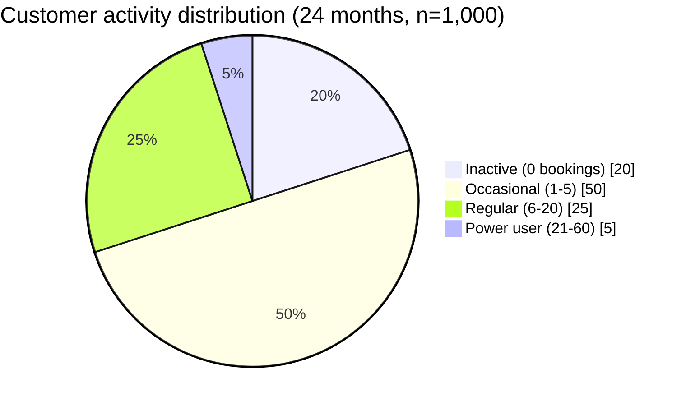
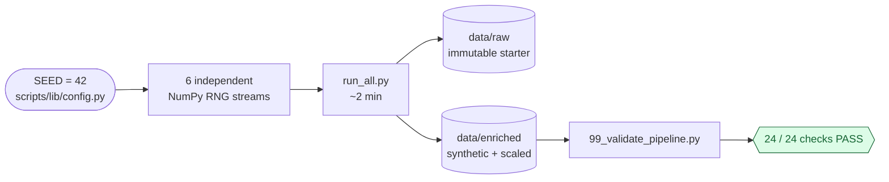

# Part 1 — Assumptions

The brief asks us to *"document your assumptions and explain why your added data is useful"*. This document covers the load-bearing assumptions only — all values are tunable in `scripts/lib/config.py`.

## 1. Anchoring to the starter dataset

The five starter entities (airports, routes, customers, flights, bookings) are preserved as-is in `data/raw/`. Everything generated is downstream in `data/enriched/`, so a reviewer can trace any new value back to its source.

- **Starter customers (300)** carried unchanged into the enriched layer — a join on `customer_id ≤ CUST0300` proves continuity.
- **IATA codes** are reused (ABJ, CDG, etc.) — no invented airports.

## 2. Time window — 24 months (2024-01-01 → 2025-12-31)

- 12 months is insufficient to compute customer **recency / churn** (180-day signal needs history before the window starts).
- 24 months exposes seasonality across two annual cycles.
- 36 months would slow down the local DuckDB demo without improving the analysis.

## 3. Customer activity distribution

The starter had 100% active customers — unrealistic. We add 700 new customers and impose a long-tail distribution:

| Bucket | Share | Bookings / 24 months |
|---|---|---|
| Inactive | 20% | 0 |
| Occasional | 50% | 1–5 |
| Regular | 25% | 6–20 |
| Power user | 5% | 21–60 |

→ ~80% active customer base, aligned with flag-carrier benchmarks. Critical for the **Repeat Booking Rate** and **Recency** KPIs.

## 4. Unstructured feedback (the brief's mandatory dataset)

- **3,000 rows** of free-text customer feedback in `data/enriched/customer_feedback.parquet`.
- **Bilingual** FR 65% / EN 30% / mixed 5% (reflects Air CIV's francophone-plus-international mix).
- **Free text only** — sentiment, complaint category, and tags are *deliberately not stored at generation*. They are derived downstream by the dbt staging NLP pipeline (Part 2). This is the choice that turns the dataset into a real unstructured-to-structured exercise instead of a relabelled lookup.
- Polarity correlates with operational reality: a feedback row linked to a disrupted flight is 75% negative, vs 35% otherwise.

## 5. Reproducibility

- Single global `SEED = 42` in `scripts/lib/config.py`.
- Independent NumPy RNG streams per entity (10, 11, 12, 13, 14, 15) — changing one generator doesn't perturb the others.
- End-to-end regeneration: `python scripts/run_all.py` → ~2 minutes. Validation: `python scripts/99_validate_pipeline.py` → 24/24 checks PASS.

