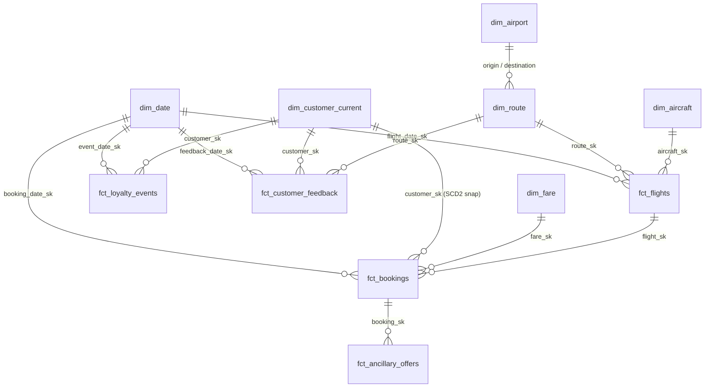
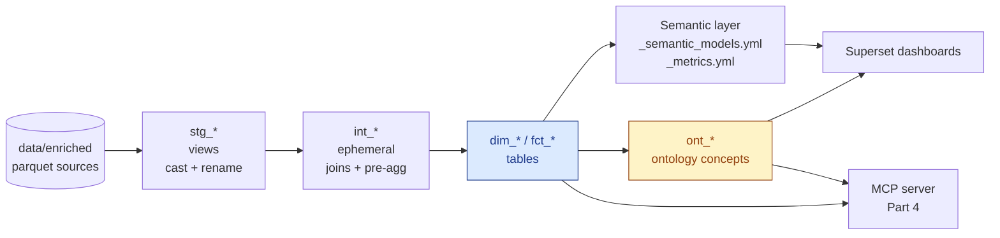
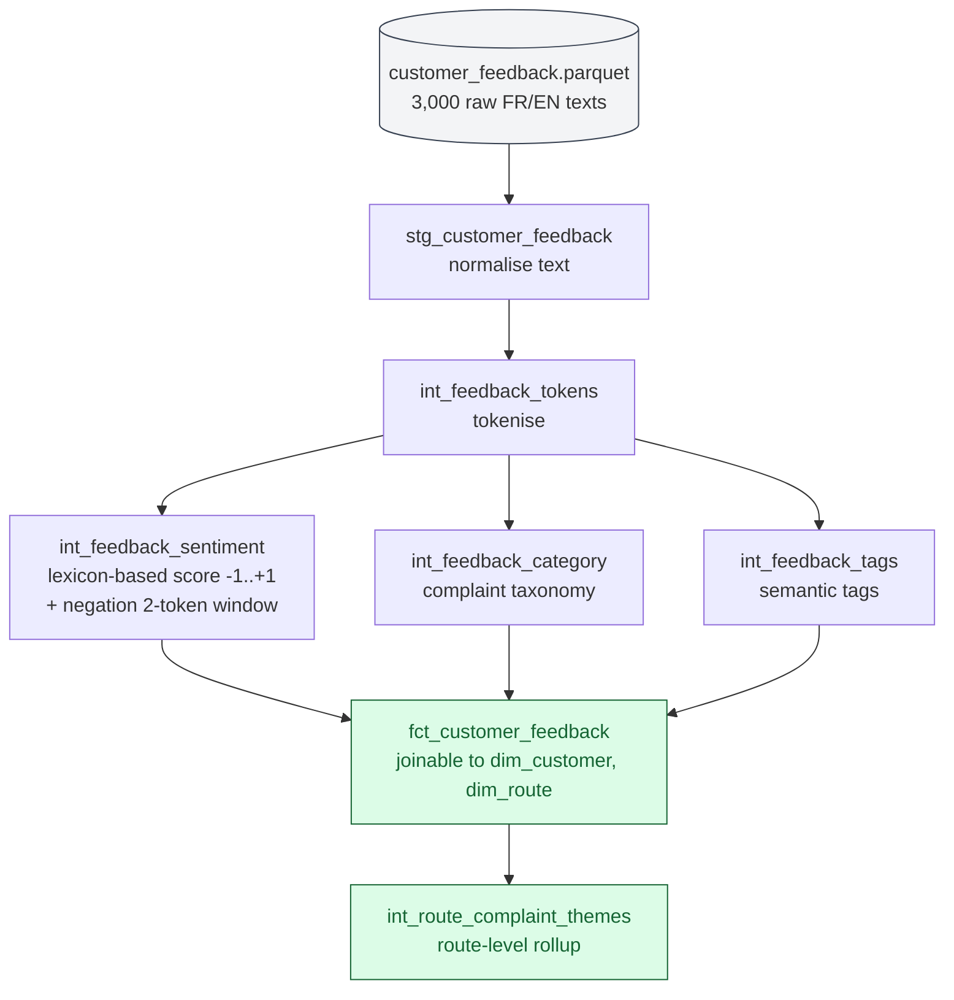

# Part 2 — Model, semantic layer, ontology & unstructured integration

This single document covers the four Part-2 brief requirements:
modelling choice, semantic layer, ontology, and unstructured-data integration.

---

## 1. Modelling choice — Star Schema + targeted SCD2 on `dim_customer`

| Criterion | Star | Data Vault | Hybrid | Weight |
|---|---|---|---|---|
| Single synthetic source, ~5M rows | ✅ | ❌ overkill | ❌ | High |
| Consumed by BI (Part 3) & AI agent (Part 4) | ✅ | ❌ needs vues | ⚠️ | High |
| Audit of multi-source merges | ⚠️ | ✅ | ✅ | Low (one source) |
| Historisation of changing attributes | native limit | ✅ | ✅ | Medium → addressed by **targeted SCD2** |

**Decision**: star schema, with a **SCD2 snapshot on `dim_customer`** for `loyalty_tier` only — needed to compute "tier at booking time" for retention KPIs. Other dimensions remain SCD1 (no business reason for history).

---

## 2. The model — 5 facts × 6 dimensions

Lecture en étoile : les `dim_*` (gauche) gravitent autour des `fct_*` (centre/droite) ; les surrogate keys `_sk` (générées par `dbt_utils.generate_surrogate_key`) matérialisent chaque branche de l'étoile.

Three brief themes → mart coverage:

| Theme | Tables |
|---|---|
| Route optimization & growth | `fct_flights`, `dim_route`, `dim_aircraft`, `int_route_monthly_perf` |
| Customer retention | `fct_bookings`, `fct_customer_feedback`, `dim_customer_current` (+ SCD2) |
| Upsell / cross-sell | `fct_ancillary_offers`, `fct_bookings`, `dim_fare` |

Materialisations: `view` for staging, `table` for marts and ontology, `ephemeral` for intermediate helpers. **160 / 160 dbt tests PASS** after `dbt build`.

---

## 3. Semantic layer

The brief asks for **core entities + KPI definitions + joins + naming conventions**. All four live in two YAML files:

| Brief item | Source of truth | Where |
|---|---|---|
| Core entities (Customer, Flight, Booking, Route, Feedback) | `dbt/models/semantic/_semantic_models.yml` | 5 semantic models |
| Joins between entities | declared via `entities` (primary / foreign) in the same YAML | inline |
| KPI definitions (the 10 from Part 1) | `dbt/models/semantic/_metrics.yml` | 10 metrics, each with formula |
| Naming conventions | this document, §6 | below |

KPIs covered (mirror Part 1):
`route_revenue`, `route_margin_pct`, `load_factor`, `delay_rate`, `cancellation_rate`, `repeat_booking_rate`, `loyalty_engagement`, `ancillary_attach_rate`, `customer_sentiment`, `recency_days`.

---

## 4. Ontology — reasoning rules that classify business concepts

The brief gives two examples: *High-Value At-Risk Customer* and *Strategic Underperforming Route*. Both are implemented as dbt models in `dbt/models/ontology/`:

| Concept | Rule (declarative) |
|---|---|
| **HighValueAtRiskCustomer** | `monetary_total_percentile ≥ 0.60` ∧ `recency_percentile ≥ 0.60` ∧ (complaint OR negative sentiment OR churn_risk ≥ 0.40) |
| **StrategicUnderperformingRoute** | `is_strategic = true` ∧ `margin_percentile_among_strategic ≤ 0.50` ∧ `load_factor_12m ≥ 0.65` |

The full rules — machine-readable, language-agnostic — are in `docs/05_ontology_rules.yml`. Three additional concepts (`PremiumUpsellCandidate`, `LoyalDetractor`, `IROPSHeavyRoute`) are kept in the same folder because the Part-4 AI agent surfaces them; they share the same SQL-plus-YAML pattern.

**Why this format and not OWL/SHACL?** Because the consumer is a BI tool and an LLM, not a triple store. SQL + YAML is readable by all three (humans, dbt, MCP) without an extra runtime.

---

## 5. Unstructured-data integration

The brief lists four examples — *sentiment scoring, complaint categories, route-level issue themes, or semantic tags*. We deliver the first one as the load-bearing demonstration; the others are by-products in the same pipeline.

**Pipeline (dbt-native, rule-based, explainable):**

**Worked example** — what the input looks like and what the model derives:

| `raw_text` (input) | `sentiment_score` | `sentiment_label` |
|---|---|---|
| `Bagage perdu entre Paris et Abidjan, service injoignable.` | −1.0 | negative |
| `Surclassement gratuit en classe affaires, expérience fantastique.` | +1.0 | positive |

The lexicon (145 polarised words FR+EN), the complaint taxonomy and the negation list live in `dbt/seeds/`. We picked rule-based over a transformer model so every score is traceable to specific words in the source row — an exec can defend any number on the dashboard.

---

## 6. Naming conventions

| Prefix / suffix | Meaning |
|---|---|
| `stg_*` | Staging — 1:1 with source, cast + rename only |
| `int_*` | Intermediate — joins / pre-aggregations |
| `dim_*` | Dimension (conformed) |
| `fct_*` | Fact (grain documented in each model) |
| `ont_*` | Ontology concept |
| `_sk` | Surrogate key (integer, generated by `dbt_utils.generate_surrogate_key`) |
| `_id` | Natural key (varchar) — carried for traceability |
| `_date` | Date (no time) |
| `_at` | Timestamp |
| `_usd` | USD monetary amount |
| `_pct` | Fraction in `[0, 1]` |
| `is_*`, `has_*` | Booleans |

Snake case everywhere. Singular vs plural follows the dbt community convention: tables singular where natural (`dim_route`) but plural when colloquial (`fct_bookings`).
