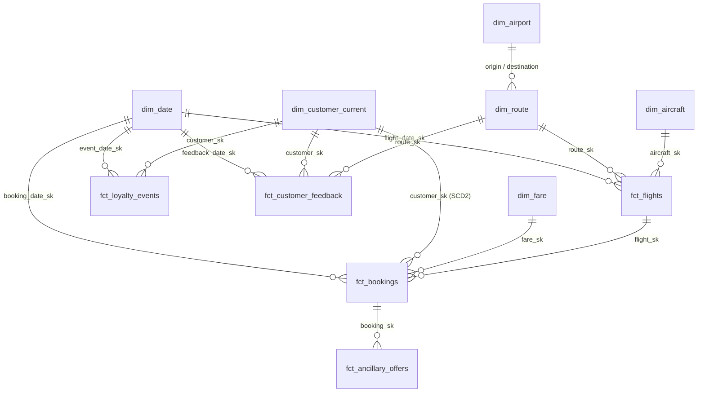

# Part 2 — Model, semantic layer, ontology & unstructured integration

This single document covers the four Part-2 brief requirements:
modelling choice, semantic layer, ontology, and unstructured-data integration.

---

## 1. Modelling choice — Star Schema + targeted SCD2 on `dim_customer`

| Criterion | Star | Data Vault | Hybrid | Weight |
|---|---|---|---|---|
| Single synthetic source, ~5M rows | ✅ | ❌ overkill | ❌ | High |
| Consumed by BI (Part 3) & AI agent (Part 4) | ✅ | ❌ needs vues | ⚠️ | High |
| Audit of multi-source merges | ⚠️ | ✅ | ✅ | Low (one source) |
| Historisation of changing attributes | native limit | ✅ | ✅ | Medium → addressed by **targeted SCD2** |

**Decision**: star schema, with a **SCD2 snapshot on `dim_customer`** for `loyalty_tier` only — needed to compute "tier at booking time" for retention KPIs. Other dimensions remain SCD1 (no business reason for history).

---

## 2. The model — 5 facts × 6 dimensions



Surrogate keys (`_sk`) are generated with `dbt_utils.generate_surrogate_key`. Materialisations: `view` for staging, `table` for marts and ontology, `ephemeral` for intermediate helpers. **160 / 160 dbt tests PASS**.

**Theme → table coverage**:

| Theme | Tables |
|---|---|
| Route optimisation & growth | `fct_flights`, `dim_route`, `dim_aircraft`, `int_route_monthly_perf` |
| Customer retention | `fct_bookings`, `fct_customer_feedback`, `dim_customer_current` (SCD2) |
| Upsell / cross-sell | `fct_ancillary_offers`, `fct_bookings`, `dim_fare` |

---

## 3. Semantic layer

Everything the brief asks for (entities, KPI definitions, joins, naming) lives in two YAML files:

| Brief item | Where |
|---|---|
| 5 core entities (Customer, Flight, Booking, Route, Feedback) | [`_semantic_models.yml`](../dbt/models/semantic/_semantic_models.yml) |
| Joins between entities | declared as `entities` (primary / foreign) in the same file |
| KPI definitions (10 from Part 1) | [`_metrics.yml`](../dbt/models/semantic/_metrics.yml) |
| Naming conventions | §6 below |

KPIs: `route_revenue`, `route_margin_pct`, `load_factor`, `delay_rate`, `cancellation_rate`, `repeat_booking_rate`, `loyalty_engagement`, `ancillary_attach_rate`, `customer_sentiment`, `recency_days`.

---

## 4. Ontology — reasoning rules that classify business concepts

The brief names two concepts; we deliver both, plus three derived ones used by the Part-4 AI agent. All in [`dbt/models/ontology/`](../dbt/models/ontology/), with declarative rules in [`docs/05_ontology_rules.yml`](05_ontology_rules.yml).

| Concept | Rule |
|---|---|
| **HighValueAtRiskCustomer** *(brief)* | `monetary_pct ≥ 0.60` ∧ `recency_pct ≥ 0.60` ∧ (complaint ∨ negative sentiment ∨ `churn_risk ≥ 0.40`) |
| **StrategicUnderperformingRoute** *(brief)* | `is_strategic = true` ∧ `margin_pct_among_strategic ≤ 0.50` ∧ `load_factor_12m ≥ 0.65` |
| PremiumUpsellCandidate | Standard/Business + Silver/Gold + top-quartile upgrade acceptance |
| LoyalDetractor | Gold tier + ≥4 segments/12m + `avg_sentiment_6m < −0.3` |
| IROPSHeavyRoute | top-quintile disruption rate **OR** `cancel_rate_12m > 5%` |

**Why SQL + YAML and not OWL/SHACL?** The consumers are a BI tool and an LLM, not a triple store. SQL + YAML is readable by humans, dbt, and the MCP server — no extra runtime needed.

---

## 5. Unstructured-data integration

The brief lists four examples (sentiment, complaint categories, route themes, semantic tags). We deliver all four in one dbt-native, rule-based, **fully explainable** pipeline.

```mermaid
flowchart TB
    A[(customer_feedback.parquet<br/>3,000 raw FR/EN)] --> B[stg_customer_feedback]
    B --> C[int_feedback_tokens]
    C --> D[int_feedback_sentiment<br/>lexicon score [-1,+1]<br/>+ 2-token negation window]
    C --> E[int_feedback_category<br/>taxonomy]
    C --> F[int_feedback_tags]
    D --> G[fct_customer_feedback]
    E --> G
    F --> G
    G --> H[int_route_complaint_themes]

    classDef out fill:#dcfce7,stroke:#166534,color:#166534
    class G,H out
```

| `raw_text` (input) | `sentiment_score` | `sentiment_label` |
|---|---|---|
| Bagage perdu entre Paris et Abidjan, service injoignable. | −1.0 | negative |
| Surclassement gratuit en classe affaires, expérience fantastique. | +1.0 | positive |

The lexicon (145 polarised FR+EN words), complaint taxonomy (62) and negation list (18) live in [`dbt/seeds/`](../dbt/seeds/). **Why rule-based, not a transformer?** Every score is traceable to specific words in the source row — an exec can defend any number on the dashboard. A black-box BERT cannot.

---

## 6. Naming conventions

| Prefix / suffix | Meaning |
|---|---|
| `stg_*` | Staging — 1:1 with source, cast + rename only |
| `int_*` | Intermediate — joins / pre-aggregations |
| `dim_*` | Dimension (conformed) |
| `fct_*` | Fact (grain documented in each model) |
| `ont_*` | Ontology concept |
| `_sk` / `_id` | Surrogate key (int) / natural key (varchar) |
| `_date` / `_at` | Date / timestamp |
| `_usd` / `_pct` | USD amount / fraction in [0, 1] |
| `is_*`, `has_*` | Booleans |

Snake case throughout. Singular table names where natural (`dim_route`), plural when colloquial (`fct_bookings`).
