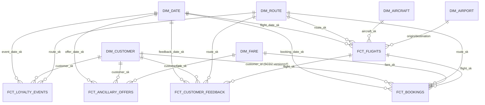

# Part 2 — Modeling choices (Star Schema + targeted SCD2)

## Decision

**Star schema** in dbt + DuckDB, with **SCD2 targeted on `dim_customer`** only.

## Rationale (deliberate trade-off)

| Criterion | Star | Data Vault | Hybrid | Weight | Notes |
|---|---|---|---|---|---|
| Volume (~5M rows, single synthetic source) | ✅ fits | ❌ overkill | ❌ | High | DV is built for very large, multi-source environments. We have one curated source. |
| BI-friendly (Apache Superset, Part 3) | ✅ native | ❌ needs views | ⚠️ | High | Superset reads dim/fact best. |
| MCP / LLM friendly (Part 4) | ✅ easy joins | ❌ many hubs/links/sats | ⚠️ | **High** | An agent reasons faster on flat fact + dim than on raw vault. |
| Auditability of multi-source merges | ⚠️ | ✅ | ✅ | Low | N/A: we have one source. |
| Historisation of slowly changing attributes | ❌ native limit | ✅ | ✅ | Medium | Solved with **targeted SCD2** below. |

### Targeted SCD2 on `dim_customer`

We snapshot only **customers**, tracking changes to `loyalty_tier`, `customer_segment`, `preferred_channel`. Reasons:

- `loyalty_tier` is the only attribute that legitimately evolves and matters for KPIs (Loyalty Tier Progression, "tier at booking time").
- `dim_route`, `dim_airport`, `dim_aircraft` are stable — full SCD2 would be over-engineering.
- `fct_bookings` joins to the customer **version** valid at `booking_date`, computing tier-at-event correctly.

## What this enables (mapped to the brief's three themes)

| Theme | Fact tables used | Dimensions used | KPIs unlocked |
|---|---|---|---|
| **Route optimization & growth** | `fct_flights` + `int_route_monthly_perf` | `dim_route`, `dim_aircraft`, `dim_date`, `dim_airport` | Route Revenue, Margin %, Load Factor, OTP15, Cancel Rate, RASK |
| **Customer retention** | `fct_bookings` + `fct_customer_feedback` + `fct_loyalty_events` | `dim_customer_current` + SCD2 snapshot, `dim_date`, `dim_route` | RFM, CLV, Churn Risk, Repeat Rate, Avg Sentiment, Tier Progression |
| **Upsell / Cross-sell** | `fct_ancillary_offers` + `fct_bookings` | `dim_customer_current`, `dim_fare`, `dim_route` | Attach Rate, ARPP, Upgrade Conversion, Offer Acceptance, Premium Mix |

## ERD (Mermaid)



Five ontology concepts derive from these marts:

```
ont_high_value_at_risk_customer    ←  dim_customer_current + int_customer_lifetime + fct_customer_feedback
ont_strategic_underperforming_route ←  int_route_monthly_perf + dim_route
ont_premium_upsell_candidate        ←  fct_ancillary_offers + dim_customer_current
ont_loyal_detractor                 ←  dim_customer_current + fct_customer_feedback
ont_irops_heavy_route               ←  fct_flights + dim_route
```

## Materialisations (per layer)

| Layer | Default | Why |
|---|---|---|
| Staging | `view` | Cheap, always-fresh, no storage cost |
| Intermediate (metric calcs) | `ephemeral` (small) / `table` (reused) | NLP outputs are tables since reused by multiple marts |
| Intermediate / NLP | `table` | Reused across marts and ontology |
| Marts (dim + fct) | `table` | Reused everywhere, scan-heavy |
| Ontology | `table` | Refreshed on cadence per business owner |

## Volume check after `dbt build`

| Layer | Models | Rows after build |
|---|---|---|
| Staging | 14 views | (passthrough) |
| Intermediate | 12 (ephemeral + table) | ~1.5M (NLP + perf agg) |
| Marts | 11 (6 dim + 5 fct) | ~1.1M bookings, 8.7k flights, 3k feedback |
| Ontology | 5 concepts | 20 + 2 + 48 + 22 + 1 |
| Tests | 116 generic + 3 singular | 160 PASS / 0 FAIL |
