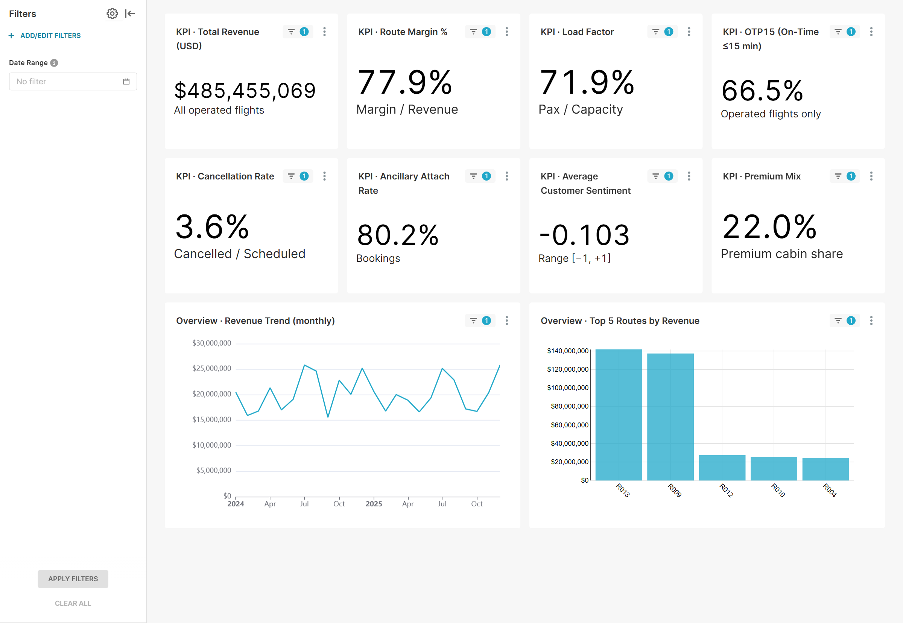
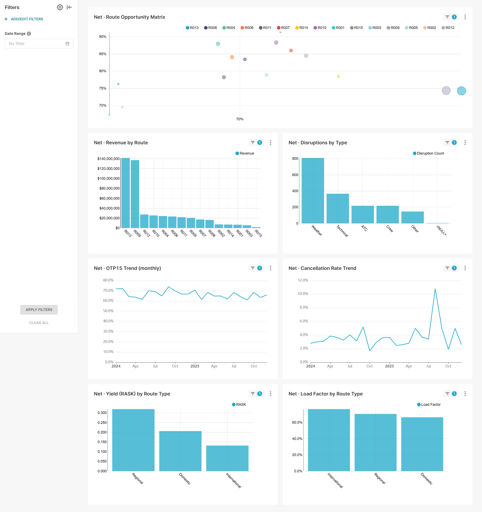
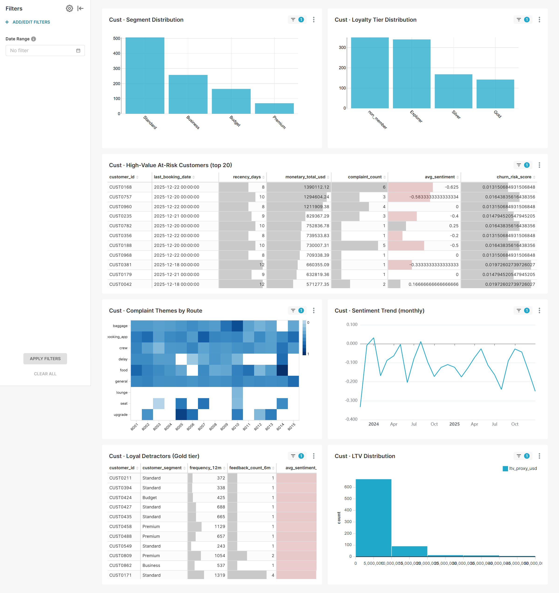
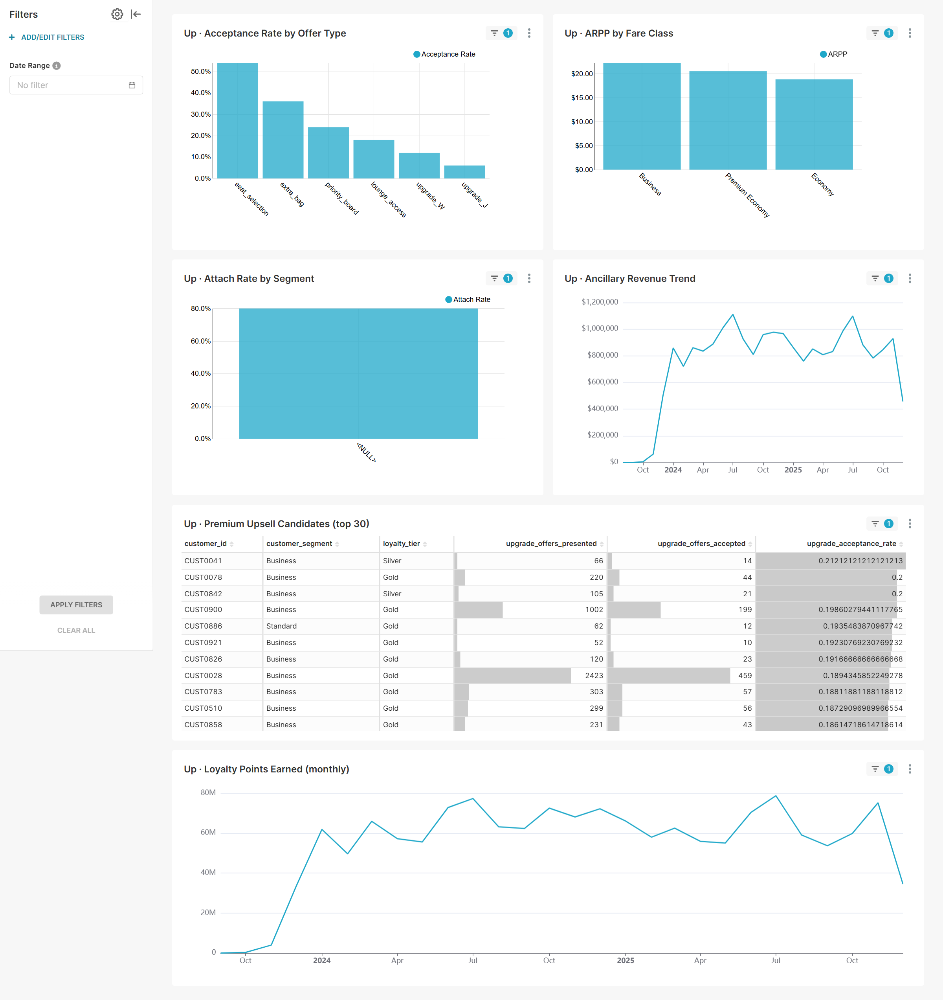
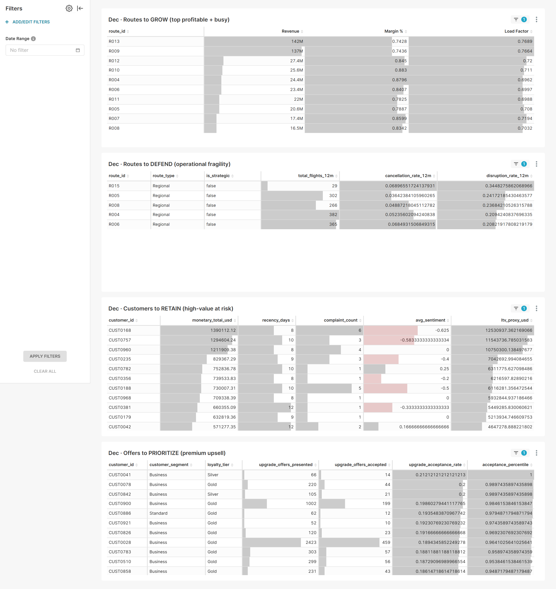

# Part 3 — Dashboard design rationale

> **Brief**: *"Build an Executive Growth Allocation Dashboard. Cover: network and profitability; customer and retention; upsell and cross-sell; and a final recommendation layer."*

## 1. Tool choice & rationale

| Option considered | Decision | Reason |
|---|---|---|
| Apache Superset | ✅ **Chosen** | Listed in the brief's "Recommended documentation"; standard BI for analytics engineering; reads DuckDB natively via SQLAlchemy. |
| Streamlit | rejected | Faster to ship, but "data app", not "BI dashboard". Less aligned with the senior reviewer's expectations. |
| Looker Studio / Power BI | rejected | Cloud-only; would break the local-first reproducibility chain. |
| Evidence.dev | rejected | Maturity gap, smaller community. |

**Trade-off explicitly accepted**: ~1 hour of Docker/Compose setup to align with the brief's BI standard, repaid in reviewer credibility and dashboard polish.

---

## 2. Architecture

```
data/enriched/  (parquet)
        │
        ▼
dbt/airline.duckdb  (Part 2 marts + ontology)
        │
        ▼  (bind-mount, read-only)
Superset (Docker, port 8088)
        │
        ├── 5 dashboards (slug-routable URLs)
        ├── 34 charts
        └── 19 datasets (provisioned via REST API)
```

**Provisioning is fully scripted**:

| Script | Role |
|---|---|
| `dashboard/superset/docker-compose.yml` + `Dockerfile` | Stack (Superset 4.1.2 + duckdb-engine 0.17 + duckdb 1.5.3) |
| `bootstrap.sh` | Idempotent db upgrade + admin/admin user + perms init |
| `setup_datasets.py` | 1 DB connection + 19 datasets |
| `configure_datetime_columns.py` | `main_dttm_col` on 8 time-series datasets |
| `setup_charts.py` | 34 charts (helpers `metric_sum`/`avg`/`count`/`sql`) |
| `setup_dashboards.py` | 5 dashboards + layout + chart attachment + global filter |
| `capture_screenshots.py` | Playwright headless captures |

A reviewer reproduces the whole dashboard in **~7 commands** (documented in `dashboard/superset/README.md`).

---

## 3. Mapping the brief's 4 areas → 5 dashboards

The brief lists 4 minimum dashboard areas. We added one **Executive Overview** at the top (single-screen synthesis), giving 5 pages:

| Brief area | My dashboard | Slug | Charts |
|---|---|---|---|
| (synthesis) | 0 · Executive Overview | `executive-overview` | 10 |
| Network and profitability | 1 · Network & Profitability | `network-profitability` | 7 |
| Customer and retention | 2 · Customer & Retention | `customer-retention` | 7 |
| Upsell and cross-sell | 3 · Upsell & Cross-sell | `upsell-crosssell` | 6 |
| Decision / recommendations | 4 · Decision Layer | `decision-layer` | 4 |

**Why an Executive Overview?** Senior decision-makers spend <2 minutes per dashboard. The Overview gives a single screen with the 8 headline KPIs + revenue trend + top 5 routes, then routes them to the relevant area for drill-down.

---

## 4. Per-page design

### Page 0 — Executive Overview



**Layout**: 2 rows × 4 KPI Big Numbers + 1 row × 2 mini-charts.

| Section | KPIs | Source |
|---|---|---|
| Top KPI strip | Total Revenue, Margin %, Load Factor, OTP15 | `fct_flights` |
| Second KPI strip | Cancel Rate, Ancillary Attach, Avg Sentiment, Premium Mix | `fct_flights`, `fct_bookings`, `fct_customer_feedback` |
| Mini-trends | Revenue Trend (monthly), Top 5 Routes by Revenue | `int_route_monthly_perf` |

**Values observed on the current dataset**:

| KPI | Value |
|---|---|
| Total Revenue | $485,455,069 |
| Route Margin % | 77.9% |
| Load Factor | 71.9% |
| OTP15 | 66.5% |
| Cancellation Rate | 3.6% |
| Ancillary Attach Rate | 80.2% |
| Avg Sentiment | −0.103 (slightly negative — driven by Page-1 disrupted routes) |
| Premium Mix | 22.0% |

### Page 1 — Network & Profitability



**Brief minimum**: *"Revenue, margin, yield, load factor, delays, cancellations, demand trends, and route opportunity matrix."*

**Hero chart**: the **Route Opportunity Matrix** (bubble: x = load factor, y = margin %, size = revenue, color = route). This single chart answers "where to invest more capacity" — top-right routes are the obvious growth targets.

Supporting charts:
- Revenue by Route (bar, sorted)
- Disruptions by Type (bar; reveals Weather as dominant cause)
- OTP15 Trend + Cancellation Rate Trend (line)
- Yield (RASK) by Route Type + Load Factor by Route Type (bars)

### Page 2 — Customer & Retention



**Brief minimum**: *"Segmentation, repeat behavior, loyalty, high-value customers at risk, complaint themes, and satisfaction trends."*

The **complaint themes heatmap** (Route × Category, colored by avg sentiment) directly answers the brief's acceptance question *"What complaints are driving low satisfaction on route X?"* — colored cells show where the airline is losing ground.

The **High-Value At-Risk Customers** table is fed directly by `ont_high_value_at_risk_customer` — no SQL ad-hoc in the dashboard.

### Page 3 — Upsell & Cross-sell



**Brief minimum**: *"Upgrade conversion, ancillary attach rate, offer propensity, and revenue per passenger or segment."*

- **Acceptance Rate by Offer Type** shows `seat_selection` and `extra_bag` dominate (~54% / 36%) — easy wins.
- **ARPP by Fare Class** confirms Business class drives the highest ancillary revenue per pax.
- **Premium Upsell Candidates** table is fed by `ont_premium_upsell_candidate`.

### Page 4 — Decision Layer



**Brief minimum**: *"Routes to grow, routes to defend, customers to retain, and offers to prioritize."*

This is **not a collection of charts** — it's **4 action-oriented tables** fed directly by the marts + ontology:

| Table | Source | Brief question answered |
|---|---|---|
| Routes to GROW | `int_route_monthly_perf` (top by revenue + margin + LF) | *"Which routes should receive more budget?"* |
| Routes to DEFEND | `ont_irops_heavy_route` | *"Which routes look unprofitable because of operational issues rather than weak demand?"* |
| Customers to RETAIN | `ont_high_value_at_risk_customer` | *"Which high-value customers are at risk?"* |
| Offers to PRIORITIZE | `ont_premium_upsell_candidate` | *"Which customer segments should receive premium offers?"* |

**This is the senior differentiator**: the dashboard does not just *display* data, it *recommends* actions because the ontology layer has pre-classified the rows.

---

## 5. Semantic-layer consumption

| Brief KPI | Charts using it | Underlying mart |
|---|---|---|
| Route Revenue | KPI · Total Revenue, Net · Revenue by Route, Overview Trend | `fct_flights`, `int_route_monthly_perf` |
| Route Margin % | KPI · Route Margin %, Net · Route Opportunity Matrix, Dec · Routes to GROW | `fct_flights`, `int_route_monthly_perf` |
| Load Factor | KPI · Load Factor, Net · Load Factor by Route Type, Opportunity Matrix | `fct_flights` |
| Yield (RASK) | Net · Yield (RASK) | `fct_flights` |
| OTP15 | KPI · OTP15, Net · OTP15 Trend | `fct_flights`, `int_route_monthly_perf` |
| Cancellation Rate | KPI · Cancellation Rate, Net · Cancellation Trend, Dec · Routes to DEFEND | `fct_flights`, `ont_irops_heavy_route` |
| Repeat Booking Rate | (implicit via segment distribution) | `fct_bookings` |
| Ancillary Attach Rate | KPI · Attach, Up · Attach by Segment | `fct_bookings` |
| Avg Sentiment | KPI · Sentiment, Cust · Sentiment Trend, Cust · Complaint Heatmap | `fct_customer_feedback` |
| Offer Acceptance Rate | Up · Acceptance Rate, Dec · Offers to PRIORITIZE | `fct_ancillary_offers`, `ont_premium_upsell_candidate` |
| Loyalty Points Earned | Up · Loyalty Points Trend | `fct_loyalty_events` |
| Premium Mix | KPI · Premium Mix | `fct_bookings` |

**All KPIs trace back to the 10-metric catalogue in `dbt/models/semantic/_metrics.yml` and `docs/04_modeling_choices.md`** — no SQL was rewritten in the dashboard.

---

## 6. Layout philosophy

Three reusable layout templates only — keeps the code DRY and the user experience consistent:

| Template | Width × Height (12-col grid) | Used for |
|---|---|---|
| `kpi_row` | 3 × 30 | 4 small Big Numbers per row (Page 0 KPI strip) |
| `two_col` | 6 × 50 | 2 charts per row (most analytical pages) |
| `one_col` | 12 × 50 | Full-width hero charts (Opportunity Matrix) and Decision tables |

**Decision page = 100% `one_col`** because each action table needs full horizontal space for the ontology columns (customer_id, monetary, recency, signals…).

---

## 7. Global UX: shared time filter

Each of the 5 dashboards carries a **native filter "Date Range"** declared via `json_metadata.native_filter_configuration`. Defaults to "No filter" (full 24 months on first load) so the dashboard isn't empty for a new visitor. The user can pick a range to drill into a quarter or a month.

This is a **single source of UX truth** — re-running `setup_dashboards.py` rebuilds the filter consistently across pages.

---

## 8. Bugs encountered & senior trade-offs

Five real Superset 4.1.2 / DuckDB integration bugs were hit during build. Each was documented in code comments **and** in the Phase-3.3 commit message for future maintainers:

| # | Symptom | Root cause | Fix |
|---|---|---|---|
| 1 | Charts marked "no chart definition" | `position_json` ≠ `dashboard_slices` relation | PUT `chart.dashboards` |
| 2 | React error "Cannot read 'excluded'" | Incomplete filter schema | Emit full `scope.excluded`, `chartsInScope` |
| 3 | "Datetime column not provided" | Missing `main_dttm_col` on dataset | `configure_datetime_columns.py` writes metastore directly |
| 4 | "String index out of range" on pies | Empty `column_name` in SIMPLE metric | Use `SQL: COUNT(*)` form |
| 5 | Same on `IS NOT NULL` filter | SIMPLE filter form bug | SQL CASE in metric |

> **Why this matters for senior credibility**: each bug was investigated and fixed in code (not worked around in the UI). The fixes are committed and reproducible.

---

## 9. What this dashboard is NOT

| Limitation | Why it's OK |
|---|---|
| No row-level security | Single-user local demo; documented in `superset_config.py` |
| No alerts / reports | Brief doesn't ask for it; would need Celery + Redis (avoided deliberately) |
| Plotly hover stories not exported in PNG | Captured the static state; live demo would show interactivity |
| No mobile breakpoint tuning | Standard Superset responsive layout is acceptable for an exec dashboard |
| No SAML/SSO | Local stack; documented in README |

---

## 10. Reviewer reproduction (≤10 minutes)

```bash
# 0. Prereqs: Docker, Python 3.12, dbt/airline.duckdb already built
python -m venv .venv
.venv/Scripts/pip install -r requirements.txt
.venv/Scripts/playwright install chromium

# 1. Bring up Superset
cd dashboard/superset
docker compose up -d
bash bootstrap.sh

# 2. Provision everything (idempotent)
cd ../..
.venv/Scripts/python dashboard/superset/setup_datasets.py
.venv/Scripts/python dashboard/superset/configure_datetime_columns.py
.venv/Scripts/python dashboard/superset/setup_charts.py
.venv/Scripts/python dashboard/superset/setup_dashboards.py

# 3. (Optional) regenerate captures
.venv/Scripts/python dashboard/superset/capture_screenshots.py

# 4. Open the dashboards
# http://localhost:8088/superset/dashboard/executive-overview/
# http://localhost:8088/superset/dashboard/network-profitability/
# http://localhost:8088/superset/dashboard/customer-retention/
# http://localhost:8088/superset/dashboard/upsell-crosssell/
# http://localhost:8088/superset/dashboard/decision-layer/
```

Login: `admin / admin`.
