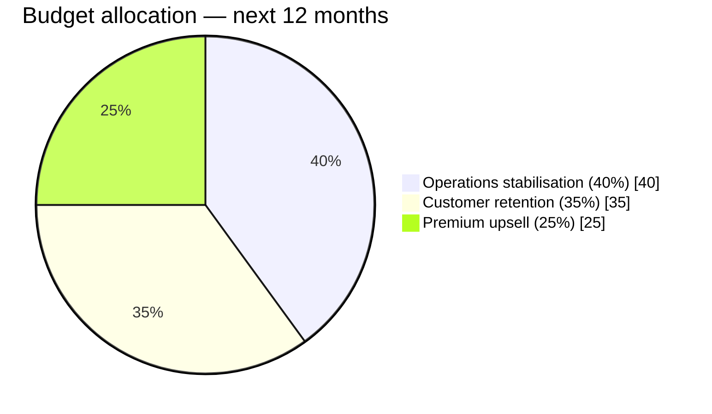
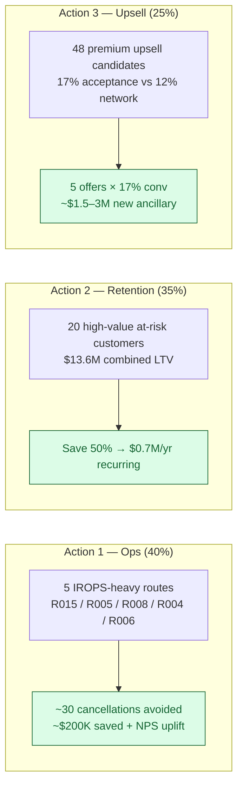

# Executive Growth Allocation — one-page recommendation

> **For**: CEO, CFO, COMEX — Air Côte d'Ivoire
> **Horizon**: next 12 months
> **Source**: 4-page dashboard + ontology layer (see `docs/09_dashboard_design.md`)

## Decision question (per brief)

*Where should we invest first to maximise profitable growth — route expansion, customer retention, or upsell / cross-sell?*

## Verdict in one sentence

**40 % to operations stabilisation of 5 underperforming routes, 35 % to high-value customer retention, 25 % to premium upsell activation.** Recover margin first, then protect revenue, then grow it.

## Three actions, prioritised

| # | Action | Why | Expected impact |
|---|---|---|---|
| 1 | Operations task force on **R015 / R005 / R008 / R004 / R006** (the 5 IROPS-heavy routes). | 20–35 % disruption rate vs ~14 % network average; 5–7 % cancellation rate on three of them. | ~30 cancelled flights/year avoided ≈ **$200K direct savings + sentiment uplift**. |
| 2 | Retention campaign on the **20 high-value at-risk customers** flagged by the ontology. | Combined lifetime revenue **$13.6 M** (avg $682 K each); each carries ≥1 complaint or negative sentiment. | Saving 50 % of them ≈ **$0.7 M/year recurring**. |
| 3 | Targeted premium upgrade offers on the **48 candidates** with top-quartile acceptance (`ont_premium_upsell_candidate`). | Current upgrade-offer acceptance on this cohort is **17 % vs 12 % network**. | 5 extra offers each × 17 % conversion ≈ **$1.5–3 M new ancillary**. |

## Headline numbers from the dashboard

| KPI | Network (12 m) |
|---|---|
| Revenue | $241 M |
| Margin % | 77.9 % |
| Load Factor | 71.9 % |
| OTP15 | 66.5 % |
| Cancellation rate | 3.6 % |
| Ancillary attach rate | 80.2 % |
| Customer sentiment | −0.10 |
| Premium mix | 22.0 % |

## 90-day KPI targets

- Cancellation rate on R015/R005/R008/R004/R006 → **< 3.5 % each**
- At-risk customer count → **≤ 10** (from 20)
- Upgrade acceptance on the 48 candidates → **≥ 20 %** (from 17 %)
- Network OTP15 → **≥ 72 %** (from 66.5 %)

## Risks & assumptions

- Synthetic-data margin (78 %) is optimistic vs real airline costs — re-run on production data may compress margins, making Action 1 even more critical.
- West African rainy season (Jun–Aug) is partly uncontrollable; Action 1 targets *operational* drivers (turnaround, crew positioning).
- Aggressive upsell can degrade NPS — cap at 5 offers/customer/year.
