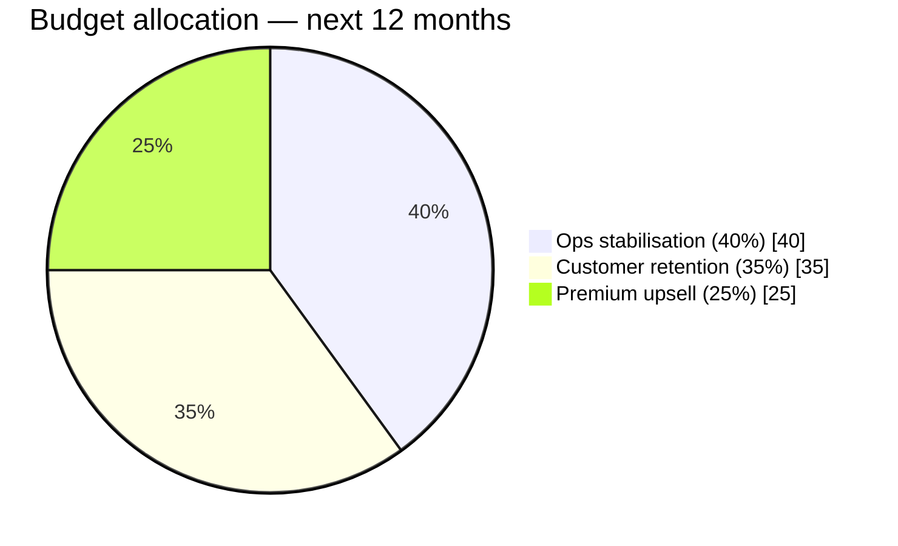

# Executive Growth Allocation — one-page recommendation

> **For**: CEO, CFO, COMEX — Air Côte d'Ivoire **Horizon**: next 12 months
> **Source**: 4 dashboards + ontology layer (see [09_dashboard_design.md](09_dashboard_design.md))

## Decision question

*Where should we invest first — routes, retention, or upsell / cross-sell?*

## Verdict

**40 % ops stabilisation → 35 % retention → 25 % premium upsell.** Recover margin first, protect revenue second, grow it third.

## Three actions

| # | Action | Why | Expected impact |
|---|---|---|---|
| 1 | Ops task force on **R015 / R005 / R008 / R004 / R006** (5 IROPS-heavy routes) | 20–35 % disruption rate vs ~14 % network; 5–7 % cancel on three | ~30 cancellations avoided/yr ≈ **$200K + sentiment uplift** |
| 2 | Retention campaign on the **20 high-value at-risk customers** | Combined LTV **$13.6 M** (avg $682 K); each carries ≥1 complaint or negative sentiment | Save 50 % ≈ **$0.7 M/yr recurring** |
| 3 | Premium upgrade offers on the **48 candidates** (`ont_premium_upsell_candidate`) | Acceptance **17 % vs 12 % network** | 5 offers × 17 % ≈ **$1.5–3 M new ancillary** |

## Network headline (12 m)

| KPI | Value | KPI | Value |
|---|---|---|---|
| Revenue | $241 M | OTP15 | 66.5 % |
| Margin % | 77.9 % | Cancellation | 3.6 % |
| Load Factor | 71.9 % | Ancillary attach | 80.2 % |
| Premium mix | 22.0 % | Customer sentiment | −0.10 |

## 90-day KPI targets

- Cancellation on R015/R005/R008/R004/R006 → **< 3.5 % each**
- At-risk customers → **≤ 10** (from 20)
- Upgrade acceptance on 48 candidates → **≥ 20 %** (from 17 %)
- Network OTP15 → **≥ 72 %** (from 66.5 %)

## Risks

- Margin (78 %) is optimistic for synthetic data; production margins will compress → makes Action 1 even more critical.
- West African rainy season (Jun–Aug) is partly uncontrollable; Action 1 targets *operational* drivers (turnaround, crew positioning).
- Aggressive upsell can degrade NPS — cap at 5 offers/customer/year.
