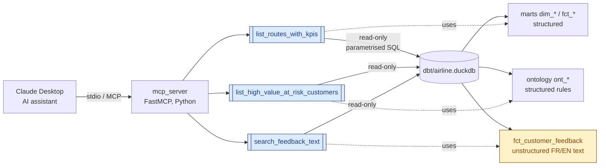

# Part 4 — MCP server (brief architecture + video script)

The brief asks for a small MCP server exposing structured + unstructured data
to an AI assistant, demonstrating a few grounded questions, with a video and a
brief architecture explanation.

## Architecture (briefly)



Three tools cover the brief's three grounded questions:

| Tool | Answers |
|---|---|
| `list_routes_with_kpis(period_months, limit)` | *"Which routes deserve more budget next quarter?"* |
| `list_high_value_at_risk_customers(limit)` | *"Which high-value customers are at risk?"* |
| `search_feedback_text(route_id, sentiment_label, limit)` | *"What complaints drive low satisfaction on route X?"* — this is the unstructured-source tool |

Every tool result carries an **audit envelope** (`sql`, `params`, `row_count`, `rows`) so an exec can verify what was queried. DuckDB is opened read-only, parameters are bound, and results are capped at 1,000 rows.

## How to run

```bash
.venv/Scripts/python -m mcp_server               # boot the server (stdio)
.venv/Scripts/python -m mcp_server.smoke_test    # answer the 3 questions end-to-end
```

To wire Claude Desktop: paste the block from `mcp_server/claude_desktop_config.json` into `%APPDATA%/Claude/claude_desktop_config.json`, replace `<PROJECT_ROOT>`, restart.

## Video — 2-minute script

| Time | On screen | Voice-over |
|---|---|---|
| 0:00–0:20 | Claude Desktop with 3 MCP tools listed in sidebar | *"Three tools, exposed via the Model Context Protocol, answer the brief's three growth-allocation questions."* |
| 0:20–0:35 | This document (architecture diagram visible) | *"FastMCP server, stdio transport, read-only DuckDB, audit envelope on every call."* |
| 0:35–0:55 | Type: "Which routes deserve more budget next quarter?" | *"Question one — list_routes_with_kpis returns each route with margin, load factor, OTP, cancellation rate."* |
| 0:55–1:15 | Type: "List the top 5 high-value customers at risk." | *"Question two — the ontology has already flagged 20 high-value customers showing dissatisfaction signals."* |
| 1:15–1:50 | Type: "What complaints drive low satisfaction on route R005? Quote a few customers verbatim." | *"Question three — search_feedback_text returns raw FR/EN customer feedback. This is the unstructured source."* |
| 1:50–2:00 | Show GitHub repo URL | *"Full code in mcp_server/."* |

Recording: ShareX or OBS, MP4 720p, save to `docs/mcp_walkthrough.mp4`.
