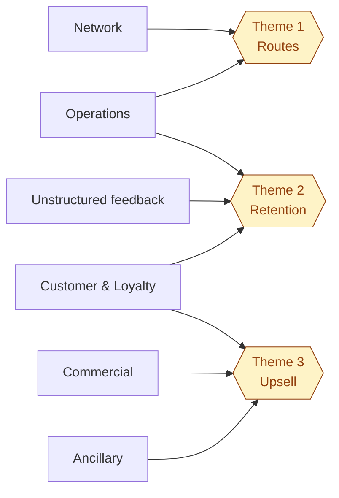

# Part 1 — Business framing & KPIs

> **Decision question (brief):** *Where should Air Côte d'Ivoire invest first — route expansion, customer retention, or upsell / cross-sell?*

## 1. Five business domains → three brief themes

| Domain                 | Owner         | 12-month strategic question                      |
| :--------------------- | :------------ | :----------------------------------------------- |
| Network & Revenue Mgmt | VP Network    | Open / reinforce / close which routes?           |
| Operations             | COO           | Which routes lose margin to ops, not demand?     |
| Commercial / Pricing   | Revenue Mgr   | Fare mix, dynamic pricing, channel?              |
| Customer & Loyalty     | CCO           | Retain / upgrade / reactivate?                   |
| Ancillary Revenue      | Ancillary Mgr | What to push, to whom, when?                     |

- **Theme 1 — Route optimisation & growth** ← Network + Operations
- **Theme 2 — Customer retention** ← Customer + Operations (delays drive churn) + unstructured feedback
- **Theme 3 — Upsell / cross-sell** ← Ancillary + Customer + Commercial

## 2. The 10 KPIs

Covers all 9 KPIs cited in the brief, plus **Recency** (the basis of the RFM churn signal).

| KPI                   | Formula                                       | Theme             |
| :-------------------- | :-------------------------------------------- | :---------------- |
| Route Revenue         | `SUM(ticket + ancillary)` on flown bookings   | Route             |
| Route Margin %        | `(Revenue − DOC) / Revenue`                   | Route             |
| Load Factor           | `SUM(pax) / SUM(seats)`                       | Route             |
| Delay Rate (OTP-inv)  | `delay_min > 15 / operated`                   | Route             |
| Cancellation Rate     | `cancelled / scheduled`                       | Route             |
| Repeat Booking Rate   | `≥ 2 bookings / active customer / 12 m`       | Retention         |
| Recency (RFM-R)       | days since last booking                       | Retention         |
| Loyalty Engagement    | points earned per active member / 12 m        | Retention         |
| Ancillary Attach Rate | `bookings with ancillary > 0 / bookings`      | Upsell            |
| Customer Sentiment    | mean score derived from feedback text         | Retention / Route |

Each formula is materialised in [dbt/models/semantic/_metrics.yml](../dbt/models/semantic/_metrics.yml) (Part 2) — single source of truth.
