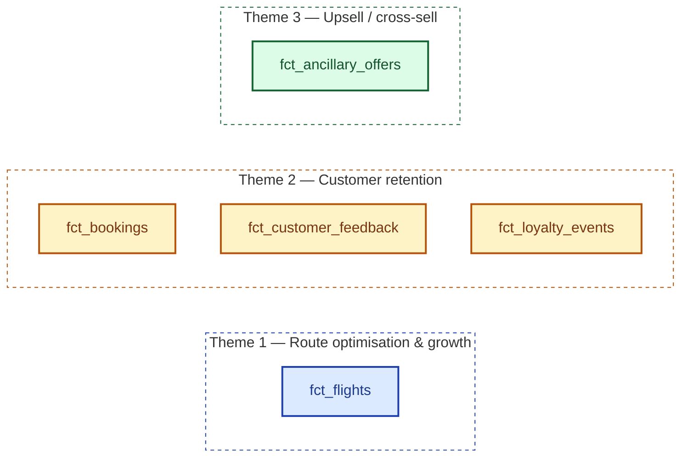
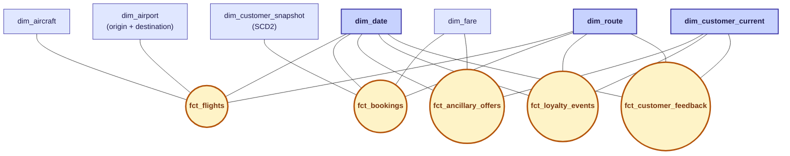
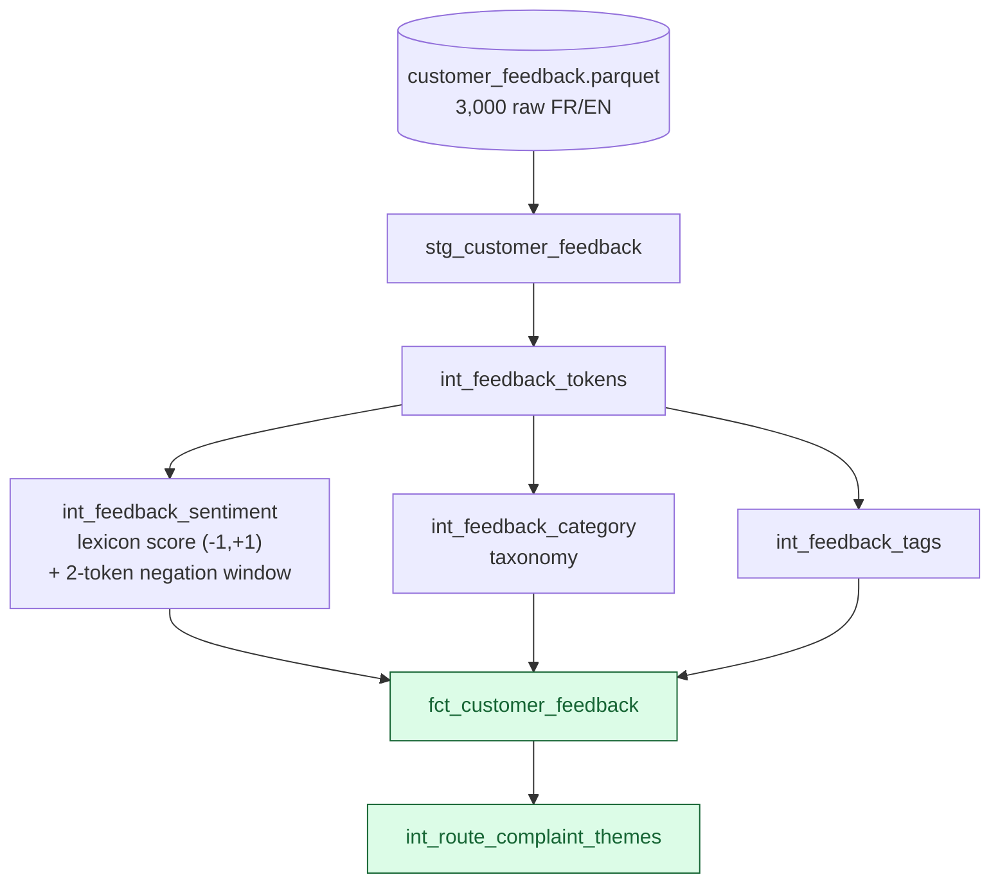

# Part 2 — Model, semantic layer, ontology & unstructured integration

This single document covers the four Part-2 brief requirements: modelling choice, semantic layer, ontology, and unstructured-data integration.

---

## 1. Modelling choice — Star schema (Kimball dimensional), implemented as a fact constellation

The brief offers three paradigms — **Star schema, Data Vault, or Hybrid**. The chosen paradigm is **Star schema** (Kimball dimensional modelling). The physical implementation is a **fact constellation** (also called *galaxy schema*) — the standard multi-process form of the star pattern, **not a different paradigm**.

### 1.1 Paradigm trade-off — the brief's three options

| Criterion                                   | Star (Kimball)  | Data Vault       | Hybrid | Weight                                   |
| :------------------------------------------ | :-------------- | :--------------- | :----- | :--------------------------------------- |
| Single synthetic source, ~5 M rows          | ✅              | ❌ overkill      | ❌     | High                                     |
| Consumed by BI (Part 3) & AI agent (Part 4) | ✅ flat tables  | ❌ Hub/Link/Sat joins are heavy for BI and verbose for LLM | ⚠️     | High                                     |
| Audit of multi-source merges                | ⚠️              | ✅               | ✅     | Low (one source)                         |
| Historisation of changing attributes        | native limit    | ✅               | ✅     | Medium → addressed by **targeted SCD2**  |

**Decision: Star schema (Kimball dimensional)**, with a **SCD2 snapshot on `dim_customer`** for `loyalty_tier` only — needed to compute "tier at booking time" for retention KPIs. Other dimensions stay SCD1 (no business reason for history).

### 1.2 Why a fact constellation and not a pure star?

A *pure* star has **one central fact**. The brief defines **three business themes**, which are three distinct business processes with **three different physical grains**:

| Theme                | Business process    | Grain                              | Fact table              |
| :------------------- | :------------------ | :--------------------------------- | :---------------------- |
| Route optimisation   | Flight operation    | 1 row = 1 flight                   | `fct_flights`           |
| Customer retention   | Booking             | 1 row = 1 booking × passenger      | `fct_bookings`          |
| Customer retention   | Customer feedback   | 1 row = 1 feedback message         | `fct_customer_feedback` |
| Customer retention   | Loyalty event       | 1 row = 1 earn / redeem            | `fct_loyalty_events`    |
| Upsell / cross-sell  | Ancillary offer     | 1 row = 1 offer presented          | `fct_ancillary_offers`  |

Forcing these grains into one fact table would break Kimball's two cardinal rules — *"never mix grains in one fact table"* and *"every row must mean exactly one thing"* — and produce `NULL`-riddled, non-additive measures. The correct dimensional pattern for multi-process projects is **multiple fact tables sharing conformed dimensions** (`dim_date`, `dim_route`, `dim_customer_current`, `dim_aircraft`, `dim_fare`, `dim_airport`) — a **fact constellation**. Each fact + its dimensions still forms its own star; the stars are joined *through* the conformed dimensions. This remains **inside the Star / Kimball family**, opposed to Data Vault — not a competing paradigm.

---

## 2. The model — 5 facts × 6 dimensions

### Structural view — galaxy schema (canonical Kimball layout)

Each **fact** sits at the centre of its own star (round hub). **Conformed dimensions** (`dim_date`, `dim_route`, `dim_customer_current`) form the shared core between stars — that's what makes this a *constellation* rather than 5 disconnected stars. **Fact-specific dimensions** sit on the outer ring.

**Legend** — 🟡 yellow hubs = facts · 🔵 dark blue = conformed dimensions (shared between stars) · 🔵 light blue = fact-specific dimensions.

**Fact-to-fact bridges** (omitted from the constellation for visual clarity):

| Bridge                                | Key          | Purpose                                                 |
| :------------------------------------ | :----------- | :------------------------------------------------------ |
| `fct_flights → fct_bookings`          | `flight_sk`  | Re-uses flight context on the booking row               |
| `fct_bookings → fct_ancillary_offers` | `booking_id` | Anchors each offer to its parent booking                |
| `fct_flights → fct_customer_feedback` | `flight_sk`  | Links feedback to a specific flight (nullable)          |

Surrogate keys (`_sk`) are generated with `dbt_utils.generate_surrogate_key`. Materialisations: `view` for staging, `table` for marts and ontology, `ephemeral` for intermediate helpers. **160 / 160 dbt tests PASS.**

**Theme → table coverage**

| Theme                       | Tables                                                                 |
| :-------------------------- | :--------------------------------------------------------------------- |
| Route optimisation & growth | `fct_flights`, `dim_route`, `dim_aircraft`, `int_route_monthly_perf`   |
| Customer retention          | `fct_bookings`, `fct_customer_feedback`, `dim_customer_current` (SCD2) |
| Upsell / cross-sell         | `fct_ancillary_offers`, `fct_bookings`, `dim_fare`                     |

---

## 3. Semantic layer

Everything the brief asks for (entities, KPI definitions, joins, naming) lives in two YAML files.

| Brief item                                                   | Where                                                                 |
| :----------------------------------------------------------- | :-------------------------------------------------------------------- |
| 5 core entities (Customer, Flight, Booking, Route, Feedback) | [`_semantic_models.yml`](../dbt/models/semantic/_semantic_models.yml) |
| Joins between entities                                       | declared as `entities` (primary / foreign) in the same file           |
| 10 KPI definitions (from Part 1)                             | [`_metrics.yml`](../dbt/models/semantic/_metrics.yml)                 |
| Naming conventions                                           | §6 below                                                              |

**KPIs:** `route_revenue`, `route_margin_pct`, `load_factor`, `delay_rate`, `cancellation_rate`, `repeat_booking_rate`, `loyalty_engagement`, `ancillary_attach_rate`, `customer_sentiment`, `recency_days`.

---

## 4. Ontology — reasoning rules that classify business concepts

The brief names two concepts; both are delivered, plus three derived ones used by the Part-4 AI agent. All in [`dbt/models/ontology/`](../dbt/models/ontology/), with declarative rules in [`docs_video_screen/05_ontology_rules.yml`](05_ontology_rules.yml).

| Concept                                       | Rule                                                                                                  |
| :-------------------------------------------- | :---------------------------------------------------------------------------------------------------- |
| **HighValueAtRiskCustomer** *(brief)*         | `monetary_pct ≥ 0.60` ∧ `recency_pct ≥ 0.60` ∧ (complaint ∨ negative sentiment ∨ `churn_risk ≥ 0.40`) |
| **StrategicUnderperformingRoute** *(brief)*   | `is_strategic = true` ∧ `margin_pct_among_strategic ≤ 0.50` ∧ `load_factor_12m ≥ 0.65`                |
| PremiumUpsellCandidate                        | Standard/Business + Silver/Gold + top-quartile upgrade acceptance                                     |
| LoyalDetractor                                | Gold tier + ≥ 4 segments / 12 m + `avg_sentiment_6m < −0.3`                                           |
| IROPSHeavyRoute                               | Top-quintile disruption rate **OR** `cancel_rate_12m > 5 %`                                           |

**Why SQL + YAML and not OWL / SHACL?** The consumers are a BI tool and an LLM, not a triple store. SQL + YAML is readable by humans, dbt and the MCP server — no extra runtime required.

---

## 5. Unstructured-data integration

The brief lists four examples (sentiment, complaint categories, route themes, semantic tags). All four are delivered in one dbt-native, rule-based, **fully explainable** pipeline.

| `raw_text` (input)                                                | `sentiment_score` | `sentiment_label` |
| :---------------------------------------------------------------- | :---------------- | :---------------- |
| Bagage perdu entre Paris et Abidjan, service injoignable.         | −1.0              | negative          |
| Surclassement gratuit en classe affaires, expérience fantastique. | +1.0              | positive          |

The lexicon (145 polarised FR + EN words), complaint taxonomy (62 entries) and negation list (18 entries) all live in [`dbt/seeds/`](../dbt/seeds/).

**Why rule-based, not a transformer?** Every score is traceable to specific words in the source row — an executive can defend any number on the dashboard. A black-box BERT cannot.

---

## 6. Naming conventions

| Prefix / suffix | Meaning                                          |
| :-------------- | :----------------------------------------------- |
| `stg_*`         | Staging — 1:1 with source, cast + rename only    |
| `int_*`         | Intermediate — joins / pre-aggregations          |
| `dim_*`         | Dimension (conformed)                            |
| `fct_*`         | Fact (grain documented in each model)            |
| `ont_*`         | Ontology concept                                 |
| `_sk` / `_id`   | Surrogate key (int) / natural key (varchar)      |
| `_date` / `_at` | Date / timestamp                                 |
| `_usd` / `_pct` | USD amount / fraction in [0, 1]                  |
| `is_*`, `has_*` | Booleans                                         |

Snake case throughout. Singular table names where natural (`dim_route`), plural when colloquial (`fct_bookings`).
