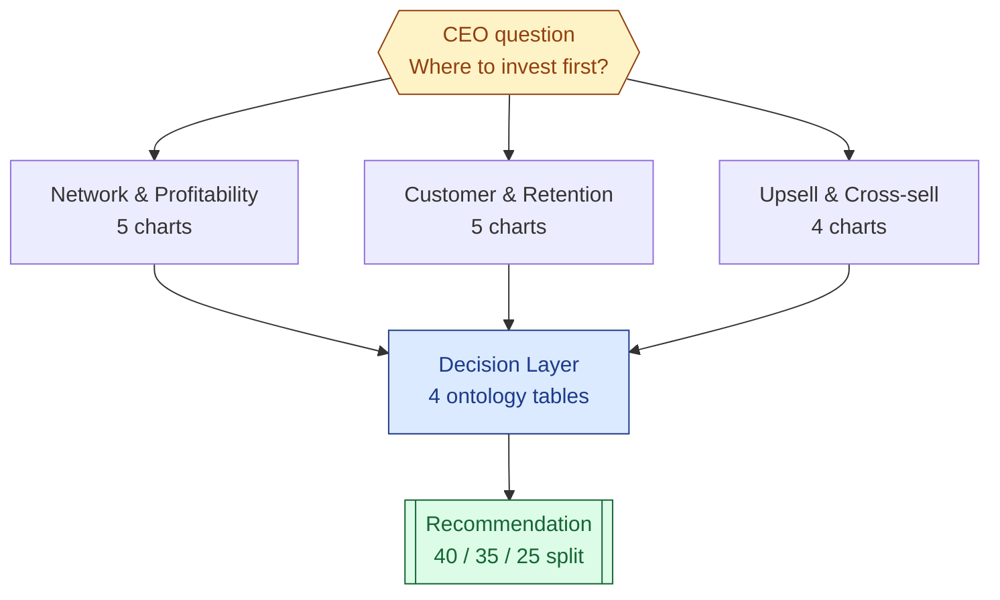

# Part 3 — Dashboard design

The brief asks for an Executive Growth Allocation Dashboard covering 4 areas, with screenshots and a one-page recommendation. The live dashboards run in Apache Superset; the recommendation is in [10_executive_recommendations.md](10_executive_recommendations.md).

## 1. Tool — Apache Superset 4.1.2

Superset runs in Docker, reading [`dbt/airline.duckdb`](../dbt/airline.duckdb) via `duckdb-engine`. It is listed in the brief's recommended documentation. **Fully reproducible** via versioned Python scripts — no drag-and-drop.

## 2. Brief areas → 4 dashboards → 18 charts

| Brief area              | Slug                    | Charts | Content                                                                          |
| :---------------------- | :---------------------- | :----: | :------------------------------------------------------------------------------- |
| Network & profitability | `network-profitability` |   5    | revenue/route, opportunity matrix, OTP+cancel trends, RASK, disruptions          |
| Customer & retention    | `customer-retention`    |   5    | segment/loyalty, at-risk table, complaint heatmap, sentiment trend, repeat rate  |
| Upsell & cross-sell     | `upsell-crosssell`      |   4    | upgrade conversion, attach by segment, rev/pax, premium candidates               |
| Decision layer          | `decision-layer`        |   4    | Grow / Defend / Retain / Prioritise — ontology-driven                            |

Every chart traces back to a Part-1 KPI or a Part-2 ontology concept — nothing invented in the BI layer.



## 3. Run

```bash
docker compose up --build -d superset superset-provisioner
```

Login `admin / admin` at <http://localhost:8088>. Each dashboard at `/superset/dashboard/<slug>/`.

## 4. Screenshots

| Area                    | File                                                                     |
| :---------------------- | :----------------------------------------------------------------------- |
| Network & Profitability | [01_network_profitability.png](screenshots/01_network_profitability.png) |
| Customer & Retention    | [02_customer_retention.png](screenshots/02_customer_retention.png)       |
| Upsell & Cross-sell     | [03_upsell_crosssell.png](screenshots/03_upsell_crosssell.png)           |
| Decision Layer          | [04_decision_layer.png](screenshots/04_decision_layer.png)               |
