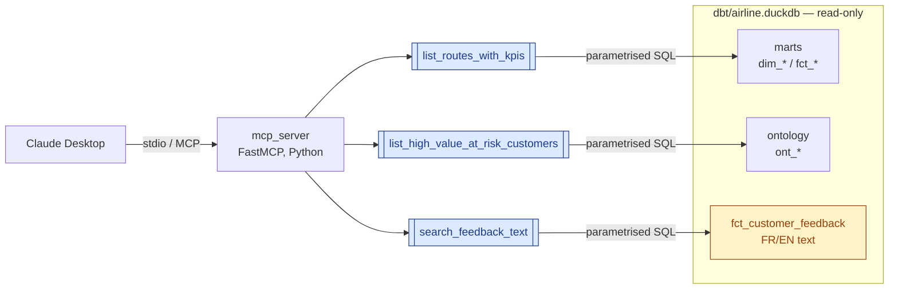

# Part 4 — MCP server architecture & video script

The brief asks for a small MCP server exposing structured + unstructured data to an AI assistant, with grounded questions, a video, and a brief architecture explanation.

## Architecture



## Three tools, three brief questions

| Tool                                                      | Answers                                                                          |
| :-------------------------------------------------------- | :------------------------------------------------------------------------------- |
| `list_routes_with_kpis(period_months, limit)`             | *Which routes deserve more budget next quarter?*                                 |
| `list_high_value_at_risk_customers(limit)`                | *Which high-value customers are at risk?*                                        |
| `search_feedback_text(route_id, sentiment_label, limit)`  | *What complaints drive low satisfaction on route X?* — **unstructured source**   |

Every tool returns an **audit envelope** (`sql`, `params`, `row_count`, `rows`) so an executive can verify what was queried. DuckDB opens read-only, parameters are bound, results capped at 1,000 rows.

## Run

Local Python:

```bash
python -m mcp_server               # boot stdio server
python -m mcp_server.smoke_test    # answer the 3 questions end-to-end
```

Docker (recommended on Windows — bypasses host-side stdio quirks):

```bash
docker compose run --rm mcp                                  # boot stdio server
docker compose run --rm mcp python -m mcp_server.smoke_test  # answer the 3 questions
```

To wire Claude Desktop:
- **Local Python** — paste the block from [`mcp_server/claude_desktop_config.json`](../mcp_server/claude_desktop_config.json) into `%APPDATA%/Claude/claude_desktop_config.json`, replace `<PROJECT_ROOT>`, restart.
- **Docker** — paste the Docker-based block from [`README.md`](../README.md#L48-L57) (§ "Wire dockerised MCP into Claude Desktop"), restart.

## Video — 2-minute script

| Time      | On screen                                                                                | Voice-over                                                                                |
| :-------- | :--------------------------------------------------------------------------------------- | :---------------------------------------------------------------------------------------- |
| 0:00–0:20 | Claude Desktop with 3 MCP tools listed                                                   | *"Three tools, exposed via MCP, answer the brief's three growth-allocation questions."*   |
| 0:20–0:35 | This architecture diagram                                                                | *"FastMCP, stdio, read-only DuckDB, audit envelope on every call."*                       |
| 0:35–0:55 | Type: *Which routes deserve more budget next quarter?*                                   | *"Tool 1 returns each route with margin, load factor, OTP, cancellation."*                |
| 0:55–1:15 | Type: *List top 5 high-value customers at risk.*                                         | *"Tool 2 — the ontology has already flagged 20 customers with dissatisfaction signals."*  |
| 1:15–1:50 | Type: *What complaints drive low satisfaction on R005? Quote a few customers verbatim.*  | *"Tool 3 — `search_feedback_text` returns raw FR/EN feedback. The unstructured source."*  |
| 1:50–2:00 | GitHub URL                                                                               | *"Full code in `mcp_server/`."*                                                           |

Recording: ShareX or OBS, MP4 720p, save to `docs_video_screen/mcp_walkthrough.mp4`.
